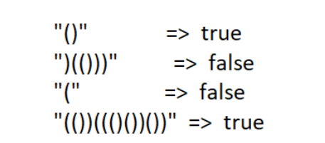

# Parentheses Order Validator 

## What is the problem to be solved?
The program will receive a string of parentheses. We want to determine if the order of the parenthesis is valid. 

## What do I know?
* Input length must be greater or equal than 0 and lower or equal than 100.
* The input may contain any ASCII character.
* The input may be empty.
* The input may not contain any parenthesis at all. 

## Problem Visualization 

## What do I need from the user? 
* The input string

## What will my program produce?
* The program will return `true` or `false` depending of the input. 
* The program will return an exception message if a constraint is not fulfilled. 

## Pseudocode
1. Validate input length
    1 If Input length is greater or equal than 0 and lower or equal than 100 Then
    2. Go to Step 2
    3.  If not Then Print an message that Input length must be greater or equal than 0 and lower or equal than 100. 
2. Validate if the input contains '(' or ')'
   1. If the input cotains '(' or ')' then Go to Step 3.
   2. If not. Return false and print a message saying that the input does not contain parentheses.
3. List creation of type character
4. Read input character by character 
   1. If character is '(' then push it into the list
   2. If character is ')' then 
      1. Validate List Length. If list length is greater than 0 then pop
      2. If not then return false
5. When finish reading the input, validate list length. 
   1. If it is greater than 0 then return false. 
   2. If it is equal to 0 then return true.

## Flow Diagram

## Test Cases
* "" => return false. Print Error Message.
* "asdfas" => return false. Print Error Message.
* "()" => true
* "((()))(a(fdsafas)fsdf)" => true
* "))()" => false
* ")" => false
* "(() asdf ))" => false